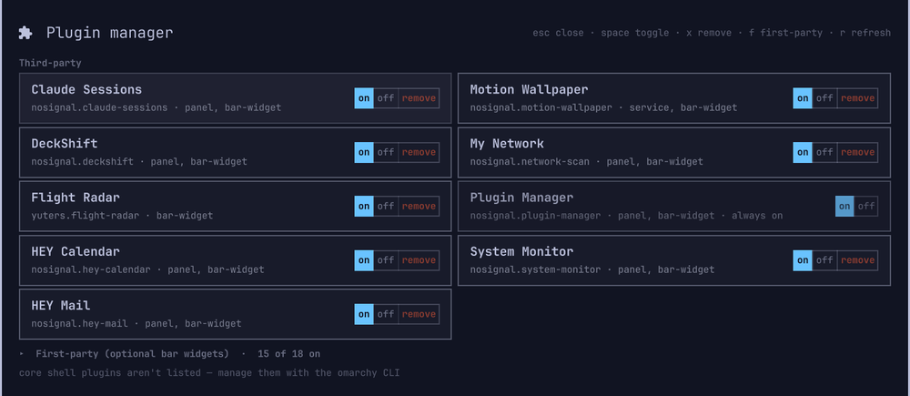
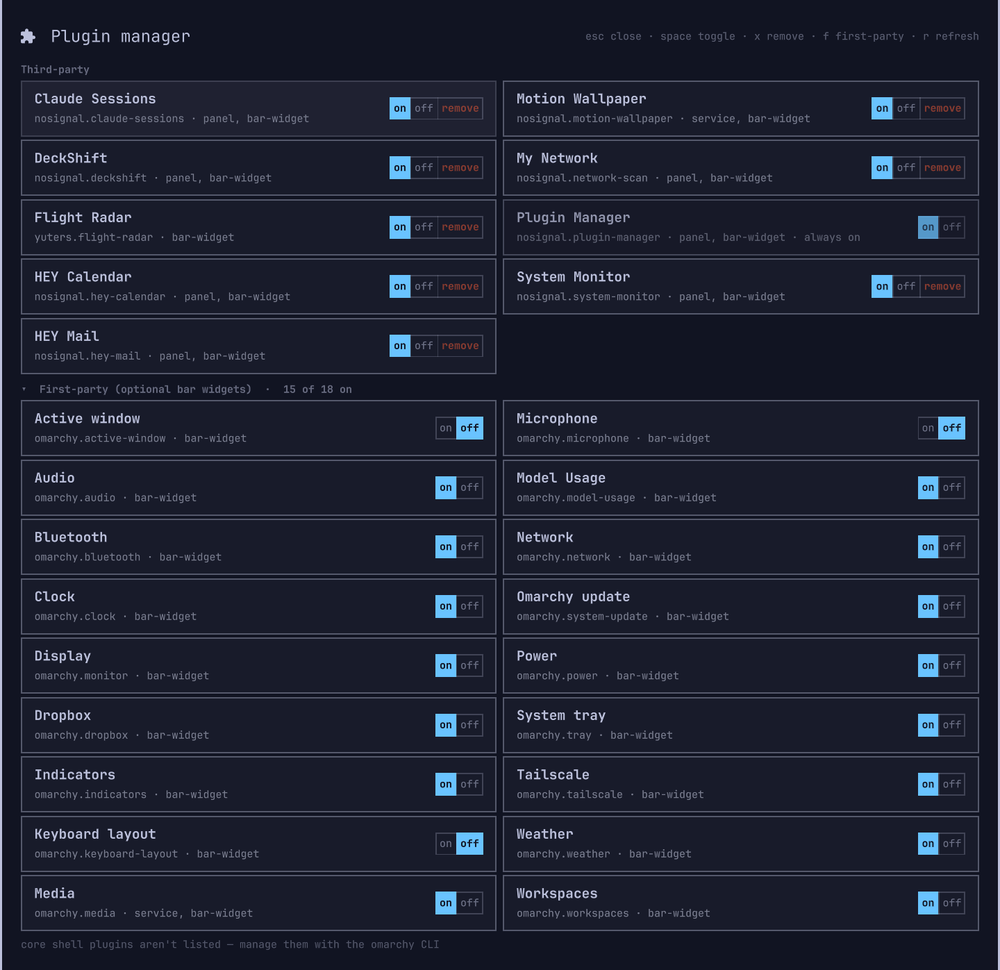
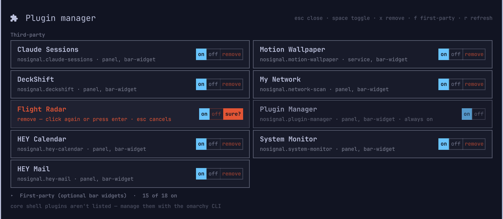

# Plugin Manager

An [Omarchy](https://omarchy.org) shell plugin that puts every optional plugin
in `omarchy-shell` — third-party plugins and the optional first-party bar
widgets — in one keyboard-driven panel, each with an **on / off / remove**
control.

It does exactly what `omarchy plugin enable` / `disable` does, without leaving
the desktop, and it re-reads the shell's real state after every toggle rather
than assuming the change stuck.

Nothing runs while the panel is closed.



## What it lists

Two groups, alphabetical within each:

- **Third-party** — every plugin you've installed yourself. Always open, at the
  top, because it's what you came here for. These are the ones you can remove.
- **First-party (optional bar widgets)** — the stock widgets you can genuinely
  turn on and off. This one is a **twirl-down, folded away by default**: it's
  long, rarely touched, and unfolded it would push your own plugins off the top
  of the list. The header still tells you what's inside — *3 of 18 on* — and
  clicking it (or pressing `f`) opens it.

Press **`f`** (or click the header) and the first-party group twirls open:



Rows flow column-major into two columns, so each group reads downward like a
directory listing. Each row shows the plugin's name, its id and kinds, and its
control. The lit segment is the current state, so the row says what it *is*
rather than making you infer it from a switch position. `remove` is an action
rather than a state — it only lights up once armed. First-party rows don't get
it at all, and neither does the manager's own row.

The card is capped at 80% of screen height. Install enough plugins to overflow
that and the list scrolls, with a scrollbar that appears only when there's
genuinely something to scroll.

Deliberately **not** listed: core shell infrastructure (`omarchy.bar`,
`polkit`, `lock`, `idle`, `notifications`, `osd`, `launcher`, `menu`,
`background`, `clipboard`, `image-picker`, `spacer`) and any first-party plugin
without a bar widget. The registry treats those as always-enabled, so a switch
for them would be a lie. Bar replacements are chosen in bar settings, not
switched here.

The plugin manager's own row is shown but locked — asking it to disable itself
gets you a polite "that's me".

## Keys

| Key | |
|-----|--|
| `↑` `↓` | move within a column (crossing into the next group at the seam) |
| `←` `→` | move between the two columns |
| `Tab` / `Shift+Tab` | walk the flat alphabetical order |
| `PgUp` / `PgDn` | move a screenful at a time |
| `Home` / `End` | first / last row |
| `Space` `↵` | toggle the selected plugin on/off |
| `x` `Del` | arm remove on the selected third-party plugin (asks first) |
| `f` | twirl the first-party group open or shut |
| `r` `F5` | re-read plugin state |
| `Esc` `q` | close (as does clicking outside) |

Mouse works too — hover selects, the segments are clickable, and clicking the
first-party header twirls it. Clicking `on` when a plugin is already on is a
no-op, not a switch-off: the segments name the state you want rather than
flipping whatever is there. Folded-away rows leave the selection model
entirely, so keyboard navigation only ever visits what's actually on screen.

## Removing a plugin

Picking `remove` (or pressing `x`) arms it — the segment turns red and reads
**sure?**, and the row explains itself:



Only a second click, `Enter` or `y` goes through; **every other
key backs out**, including `Esc`, which cancels the confirmation rather than
closing the panel. Moving the cursor abandons it, and so does picking `on` or
`off`. Nothing is deleted on a single click.

Confirming runs `omarchy plugin remove <id> --yes`, so the files go exactly
where the CLI puts them:

| The plugin is | What happens |
|---------------|--------------|
| a **symlink** (a dev checkout linked into place) | the link is removed; **your source tree is untouched** — nothing here follows a symlink |
| a **git clone** (the normal `omarchy plugin add` case) | the clone is deleted; it's still at its upstream remote |
| **anything else** | moved to a timestamped `.<id>.bak.<stamp>` beside it, so it's recoverable |

Only third-party plugins can be removed. First-party widgets live in the
shell's own tree — switch them off instead — and the manager won't remove
itself.

Two details worth knowing:

- **Every `shell.json` reference is cleared before the CLI is handed the job.**
  The CLI's own cleanup is a single `setPluginEnabled <id> false`, which clears
  one entry location per call; a plugin carrying two references would be left
  with an orphan entry pointing at a directory that no longer exists.
- **Removal always runs detached.** `omarchy plugin remove` finishes with its
  own `rescanPlugins`, and a rescan unloads every open panel — this one
  included. The runner outlives the panel, finishes the job, and re-summons the
  manager with a *Removed &lt;id&gt;* note in the footer. A failure comes back
  on the row with the reason the CLI gave.

## How enabled state is decided

A plugin counts as enabled when `shell.json` references it anywhere: a
`bar.layout` entry or a `plugins[]` entry. That is the same rule the shell's
own `PluginRegistry` uses. The `enabled` flag from `listPlugins` can't drive a
switch, because it reports every first-party plugin as always-enabled.

Two details that matter, both learned the hard way:

- **Disabling has to clear every reference.** One
  `setPluginEnabled <id> false` removes a single entry location, and a plugin
  can hold two — a `plugins[]` entry *and* a bar widget. A single call left it
  half-enabled and the switch snapped back on — the old "click twice to switch
  off" bug. The toggle now loops, checking the effective config itself, until
  the id is gone.

  `omarchy plugin enable` writes only *one* of the two for a panel + bar-widget
  plugin: the `bar.layout` entry, because `PluginRegistry.setEnabled` picks the
  bar branch of an if/else chain and never reaches the `plugins[]` push. The
  second reference is the one this plugin claims for itself on first open (see
  [If the keybinding does nothing](#if-the-keybinding-does-nothing)).
- **Toggling a panel-ish plugin destroys this panel.** The shell instantiates
  one panel delegate per enabled plugin with a `panel`, `overlay` or `menu`
  kind; changing that set rebuilds *all* of them, in both the enable and
  disable direction, and takes any attached process down with it. Those toggles
  run detached: the runner outlives the panel, finishes the config change, and
  re-summons the manager on the row you just toggled. Pure bar-widget toggles
  change nothing structural, so they run attached with no blink.

A rescan is deliberately *not* run after a toggle — it would unload every open
panel, this one included. If a plugin doesn't appear at all, run
`omarchy plugin rescan` yourself.

## Requirements

`jq`, which Omarchy already installs. Everything else is `omarchy-shell` IPC.

## Install

One command — this is the whole install:

```bash
omarchy plugin add https://github.com/28allday/omarchy-plugin-manager.git
```

`add` clones into `~/.config/omarchy/plugins/nosignal.plugin-manager/`,
validates the manifest and warns you first — plugins run as **unsandboxed
code** inside `omarchy-shell`, so read it before you enable it. It then asks
whether to enable, and which bar section to put the icon in, with **right**
pre-selected.

**`--yes` does not enable it.** It answers *no* to the enable prompt and leaves
the plugin installed but switched off. Use `--enable --yes` if you want it
enabled unattended.

Bind a key in `~/.config/hypr/bindings.lua`:

```lua
o.bind("SUPER + ALT + P", "Plugins", "omarchy-shell shell toggle nosignal.plugin-manager")
```

Hyprland picks the binding up on save; no reload needed.

The shortcut works with the bar shown, hidden, or not used at all, and it keeps
working if you take the icon out of the bar.

### Updating

```bash
omarchy plugin update nosignal.plugin-manager
```

Fetches, shows you the diff, and fast-forwards.

### Uninstalling

```bash
omarchy plugin remove nosignal.plugin-manager
```

Deletes the clone and clears its `shell.json` entries. Only run this if you
want the plugin *gone* — it is not part of installing or updating.

### If the keybinding does nothing

Almost always this means the plugin is switched off rather than anything to do
with the key. Run:

```bash
omarchy plugin enable nosignal.plugin-manager
```

Then press the key again. It takes effect immediately — no restart, no relogin.
If your bar is hidden or you don't use one, you won't see the icon this adds.

Why it happens: the panel only exists while `shell.json` references the plugin,
and for a plugin that is *both* a panel and a bar widget — this one — Omarchy's
`omarchy plugin enable` writes **only** the `bar.layout` entry, because
`PluginRegistry.setEnabled` picks the bar branch of an if/else chain and never
reaches the `plugins[]` push. So the panel used to live and die with its icon,
and `omarchy-shell shell toggle` would exit 0 and do nothing, with the reason
logged only to `/run/user/$UID/quickshell/by-pid/*/log.log`:

```
WARN qml: summon: plugin not enabled, not summoning: nosignal.plugin-manager
```

**Since 0.2.1 the panel claims a `plugins[]` reference of its own the first
time it opens**, so once you have opened it once the shortcut survives the icon
being removed. That can't rescue an install that is already switched off — with
no reference at all the shell never loads the panel, so none of its code runs.
That's what the `enable` command above is for, and you only need it once.

To set the reference up front instead — no icon in the bar at any point — add a
`plugins[]` entry to `~/.config/omarchy/shell.json` by hand:

```json
{
  "plugins": [
    { "id": "nosignal.plugin-manager" }
  ]
}
```

Or do it in one idempotent step:

```bash
f=~/.config/omarchy/shell.json
jq 'if any(.plugins[]?; .id=="nosignal.plugin-manager") then . else
      .plugins = ((.plugins // []) + [{"id":"nosignal.plugin-manager"}]) end' \
  "$f" > "$f.tmp" && mv "$f.tmp" "$f"
```

It takes effect immediately — the shell watches `shell.json`, so there's no
restart or relogin. One consequence worth knowing: while both references
exist, `omarchy plugin disable` clears only one per call, so switching the
manager off takes two runs until Omarchy clears every reference in one.

That reference is enough on its own. The panel then opens on the keybinding
with no bar icon, and with the bar hidden entirely — hiding the bar is a
`bar-off` state flag that only stops the bar window being drawn, it doesn't
touch plugin state.

## Theming

Colours come from the shell's theme tokens only (`Color.menu.*`,
`Color.accent`, `Color.urgent`) — the panel shares the `[menu]` surface, so a
theme that styles the menu styles this too. Nothing is hardcoded.

## Licence

MIT — see [LICENSE](LICENSE).
